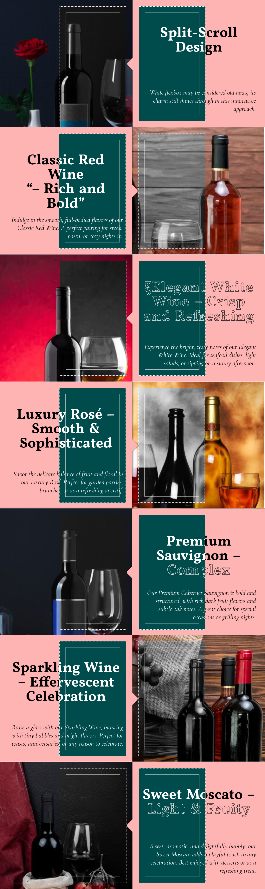
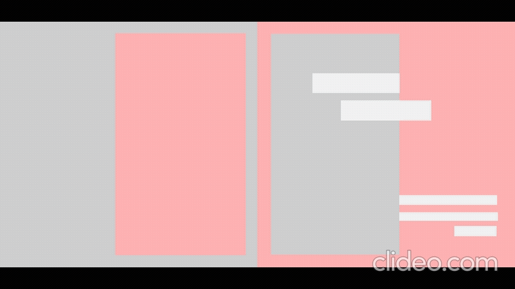
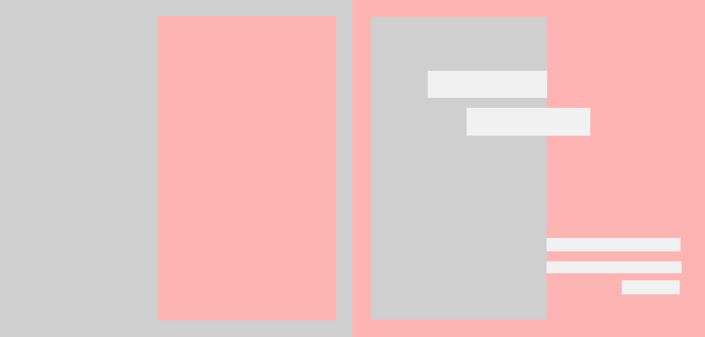
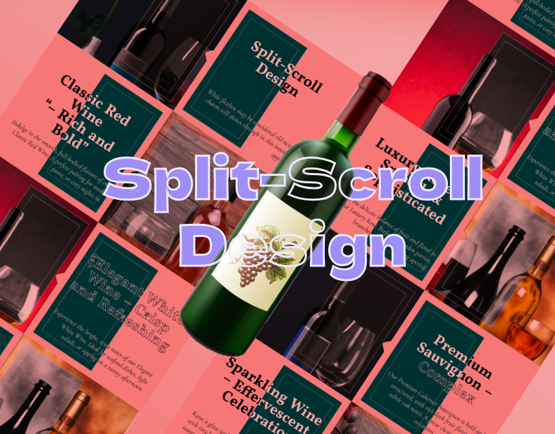

# Half-and-Half Scrolling Layout in Pure CSS

### Author
##### Virendra D. Verma

<a href="https://www.linkedin.com/in/dharmendraverma95/" target="_blank">LinkedIn Profile </a>

<a href="https://www.behance.net/dhirukumar" target="_blank">Behance Profile </a>

# Overview
This project demonstrates how to design a stunning half-and-half scrolling layout using only CSS. The layout features two independently scrollable sections within the same viewport, providing a smooth, interactive user experience without the need for JavaScript.

## Features
- Pure CSS Solution: Achieve half-and-half scrolling with no JavaScript required.
- Responsive Layout: Adjusts to different screen sizes while maintaining the independent scrolling sections.
- Smooth Scrolling: A seamless scrolling effect that enhances the user experience.

# Preview
Half-and-Half Scrolling
 

 
Half-and-Half Scrolling Start & End Point 
 

 
Half-and-Half Scrolling UI UX Layout Start & End Point
 

 
Half-and-Half Scrolling UI UX Layout
 

 
Cover
 

 

### Technologies Used
<ul>
  <li>Graphic Design Software: Photoshop, Figma (for mockups)</li>
  <li>Web Tools (Optional): HTML5, CSS3 for any digital presentations or landing pages</li>
  <li>Font Awesome (Optional for icons)</li>
</ul>

###  Acknowledgments
Inspired by the power of CSS positioning and scrolling techniques.

